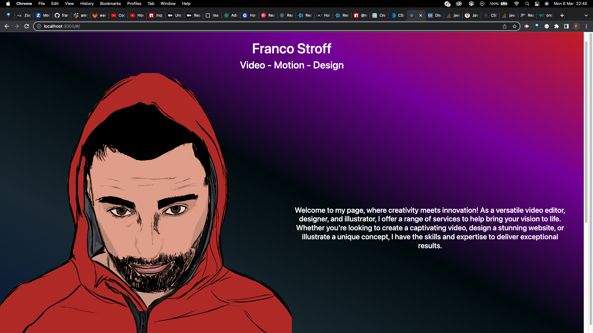

# React Portfolio

This project was bootstrapped with [Create React App](https://github.com/facebook/create-react-app).

## Available Scripts

In the project directory, you can run:

### `npm start`

Runs the app in the development mode.\
Open [http://localhost:3000](http://localhost:3000) to view it in your browser.

## Links

GitHub - https://github.com/francostroff/React-Portfolio

Live URL - https://francostroff.github.io/React-Portfolio/

## MockUp

The page will reload when you make changes.\
You may also see any lint errors in the console.

## Mock-Up

The following image shows the web application's appearance and functionality:

